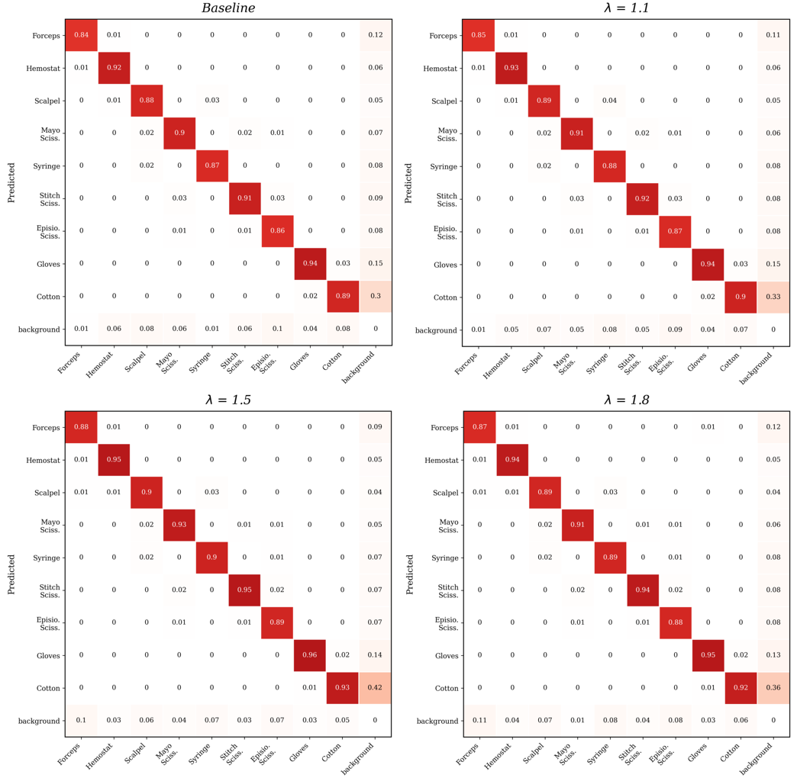
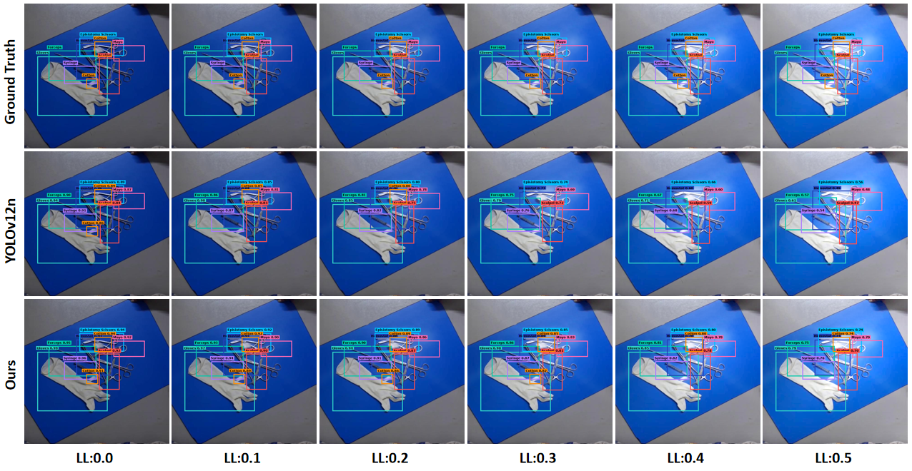
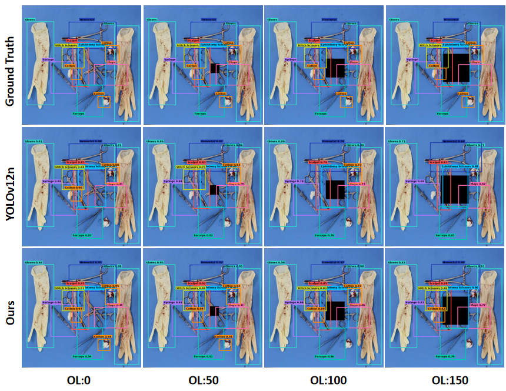

# WFD-YOLO

Official experimental scaffold for the paper:

**WFD-YOLO：融合小波-傅里叶协同注意与双域门控的手术器械检测方法**

This codebase is built on top of the uploaded **STW-YOLO-main** project and integrates the four core components described in the paper:

- **WFCA**: Wavelet-Fourier Collaborative Attention
- **SFPA**: Subband-guided Fusion Purification Attention
- **DGFA**: Dual-domain Gated Fusion Attention
- **ATFL**: Adaptive Threshold Focal Loss

## 1. Project structure

```text
WFD-YOLO/
├── Lib/
│   └── wfd_yolo12n.yaml
├── dataset/
│   └── sid_ras.yaml
├── docs/
│   └── figures/
│       ├── atfl_confusion_matrix.png
│       ├── brightness_perturbation.png
│       └── occlusion_interference.png
├── ultralytics/
│   ├── nn/
│   │   ├── tasks.py
│   │   └── modules/
│   │       ├── wfd_utils.py
│   │       ├── wfca.py
│   │       ├── sfpa.py
│   │       └── dgfa.py
│   └── utils/
│       └── atfl.py
├── wfd_train.py
├── wfd_val.py
└── wfd_ablate.py
```

## 2. Core implementations

### WFCA
File: `ultralytics/nn/modules/wfca.py`  
Parallel wavelet-frequency collaborative attention for backbone feature enhancement.

### SFPA
File: `ultralytics/nn/modules/sfpa.py`  
Frequency-guided purification module before neck fusion.

### DGFA
File: `ultralytics/nn/modules/dgfa.py`  
Adaptive gated fusion module that replaces plain neck `Concat`.

### ATFL
File: `ultralytics/utils/atfl.py`  
Adaptive threshold focal loss for hard-sample and imbalance-aware optimization.

## 3. Environment

Recommended:

- Python >= 3.10
- PyTorch >= 2.1
- CUDA >= 11.8

Install locally in editable mode:

```bash
cd WFD-YOLO
pip install -e .
```

## 4. Dataset

Default dataset config:

```bash
dataset/sid_ras.yaml
```

Update the `path:` field to your local SID-RAS root before training.

Expected structure:

```text
SID-RAS/
├── images/
│   ├── train/
│   ├── val/
│   └── test/
└── labels/
    ├── train/
    ├── val/
    └── test/
```

## 5. Training

```bash
python wfd_train.py \
  --model Lib/wfd_yolo12n.yaml \
  --data dataset/sid_ras.yaml \
  --weights yolo12n.pt \
  --imgsz 640 \
  --epochs 300 \
  --batch 16 \
  --workers 1 \
  --device 0
```

## 6. Validation

```bash
python wfd_val.py \
  --weights runs/wfd/wfd_yolo12n_sid_ras/weights/best.pt \
  --data dataset/sid_ras.yaml \
  --imgsz 640 \
  --split test \
  --device 0
```

## 7. Ablation

```bash
python wfd_ablate.py --variant baseline --data dataset/sid_ras.yaml --weights yolo12n.pt
python wfd_ablate.py --variant full --data dataset/sid_ras.yaml --weights yolo12n.pt
```

## 8. Ablation and robustness figures

### 8.1 ATFL ablation
This figure visualizes the normalized confusion matrices under different `λ` values.  
It helps illustrate why the paper selects `λ = 1.5` as the default setting.



### 8.2 Brightness perturbation
This figure compares the baseline model and WFD-YOLO under different brightness perturbation levels.  
WFD-YOLO maintains more stable predictions as illumination conditions become harder.



### 8.3 Occlusion interference
This figure compares the baseline model and WFD-YOLO under different occlusion levels.  
WFD-YOLO shows stronger robustness when targets are partially occluded.



## 9. Notes

- `WFCA` is inserted into the backbone feature extraction stage.
- `SFPA` is applied before neck fusion.
- `DGFA` replaces the original `Concat` in the neck.
- `ATFL` is enabled through the `atfl` field in `Lib/wfd_yolo12n.yaml`.

## 10. Important note

This repository is a **paper-faithful experimental implementation scaffold** generated from the final paper design and the uploaded YOLOv12-based project structure. Depending on your environment, pretrained weights, and dataset formatting, minor adjustments may still be required for fully reproducible training.
