# WFD-YOLO

WFD-YOLO is a YOLOv12n-based surgical-instrument detector for the OSI26 benchmark. The released implementation matches the revised manuscript:

- **WFCA** combines Haar wavelet structural responses and Fourier-domain semantic responses with content-dependent gating.
- **SFPA** performs Fourier-guided channel weighting, spatial purification, and gated Gaussian filtering before fusion.
- **DGFA** adaptively fuses spatial-detail and transformed-domain semantic features.
- The final detector uses the native YOLOv12 BCE + CIoU + DFL objective. ATFL is not part of the final model.

## Figures and tables from the revised manuscript

The images below are the actual figures and 600-dpi table captures from
`2182_WFD-YOLO_Revised_Manuscript.pdf`. The enhanced-resolution copies are
kept under `assets/paper_figures/` and `assets/paper_tables/` for direct
viewing or reuse when preparing the submission.

### Figures

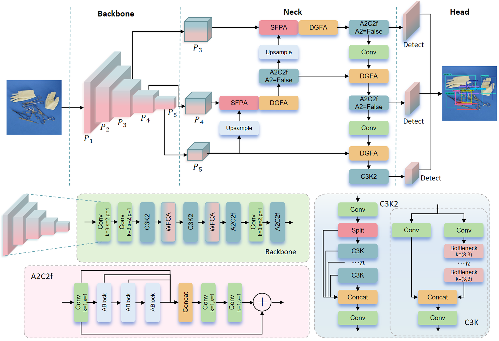

*Fig. 1. Overall architecture of WFD-YOLO. The highlighted nodes denote the
frequency-aware enhancement and adaptive fusion modules.*

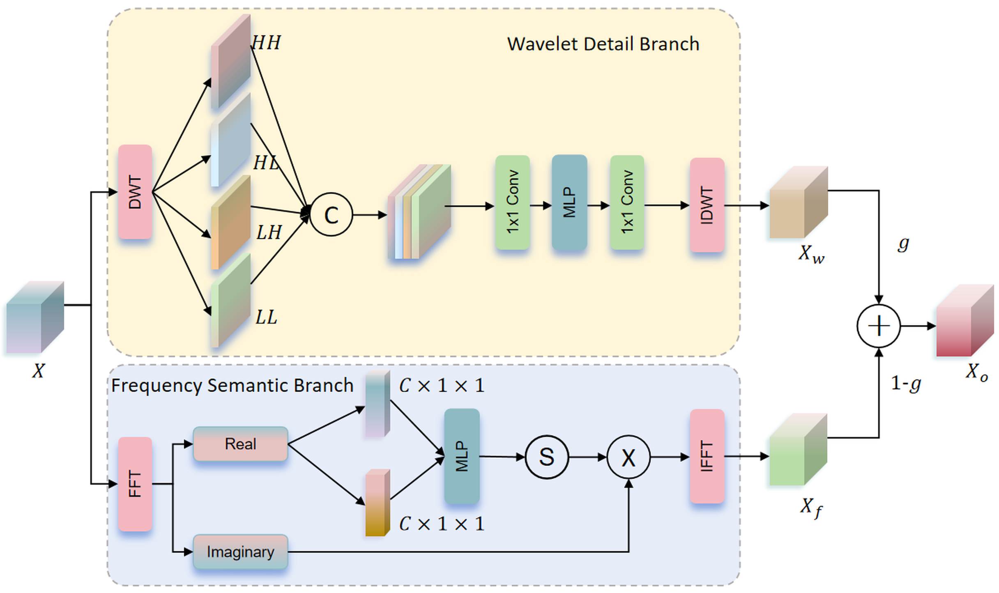

*Fig. 2. Structure of the WFCA module.*

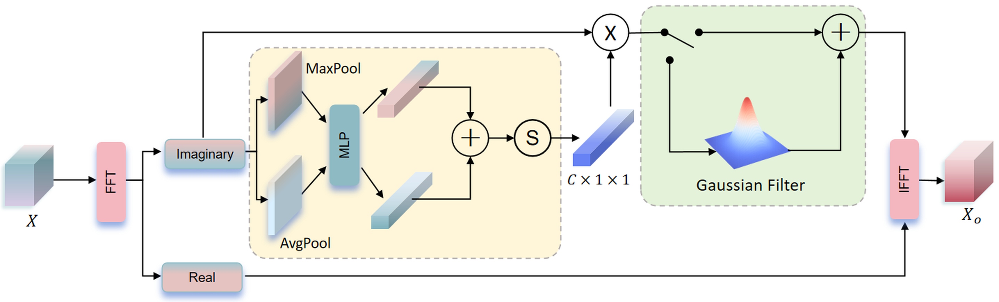

*Fig. 3. Structure of the SFPA module.*

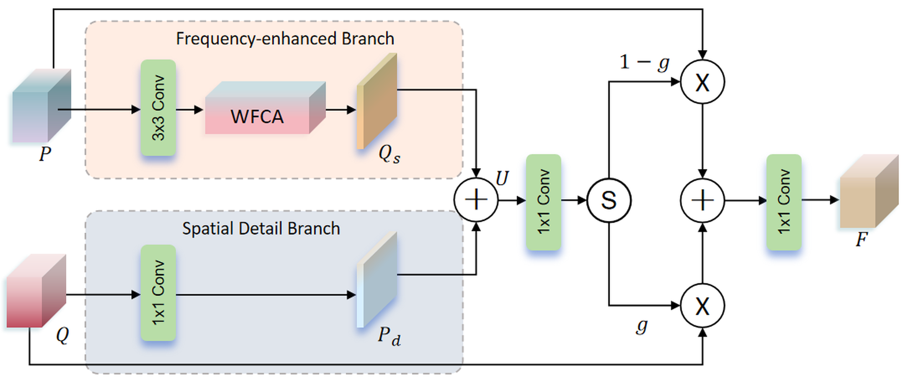

*Fig. 4. Structure of the DGFA module.*

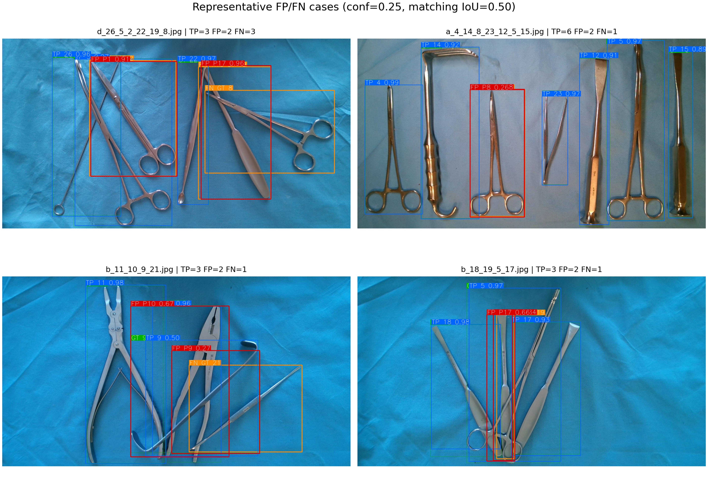

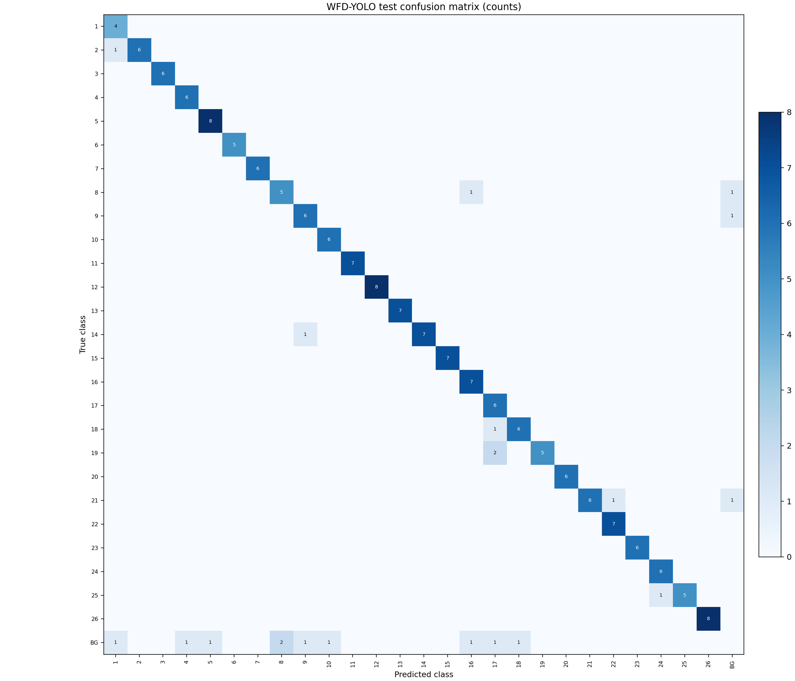

*Fig. 5. OSI26 error analysis at confidence 0.25 and matching IoU 0.50:
representative false-positive/false-negative cases and the count confusion
matrix.*

### Fig. 6 stress-test examples

The eight panels are shown in the same order as the paper: clean, brightness,
contrast, blur, smoke, specular, occlusion, and clutter.

| Clean | Brightness | Contrast | Blur |
|---|---|---|---|
|  | 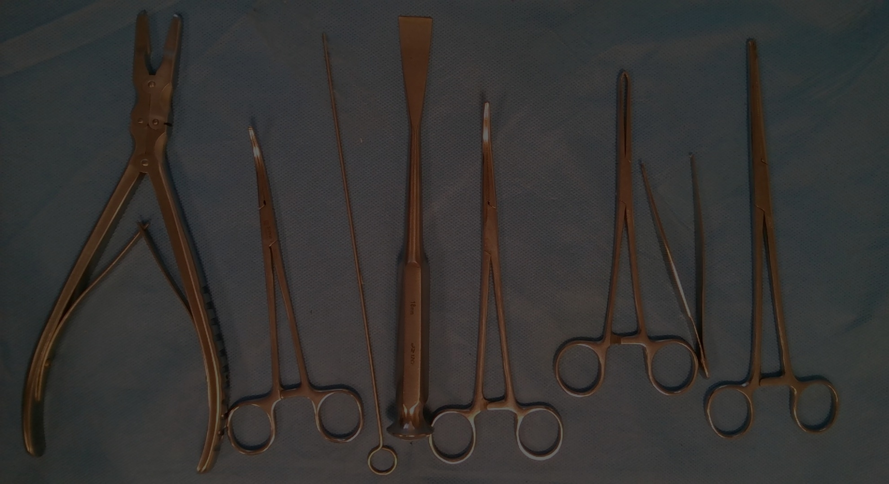 | 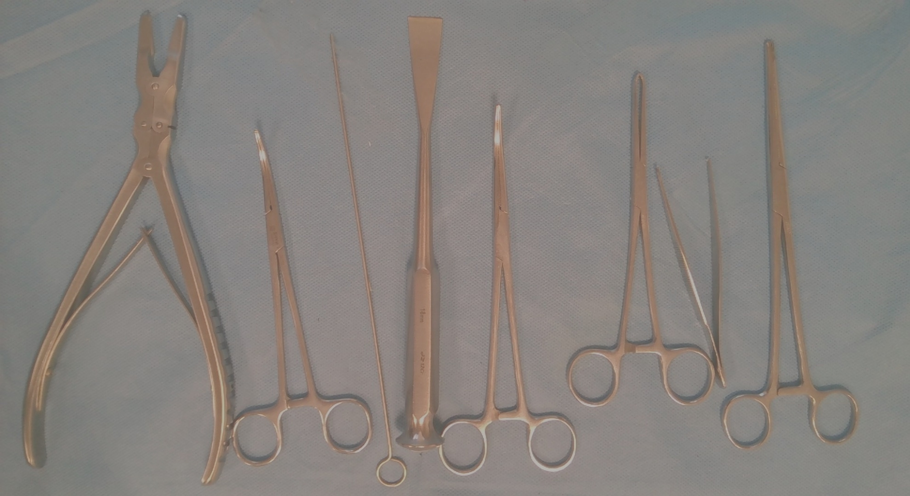 | 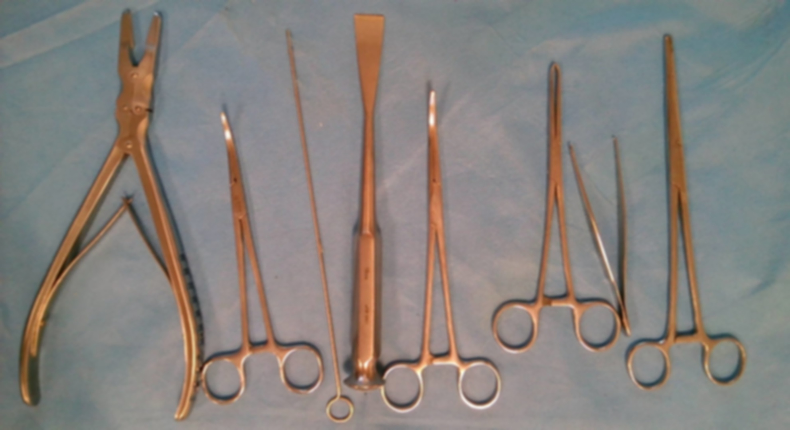 |

| Smoke | Specular | Occlusion | Clutter |
|---|---|---|---|
| 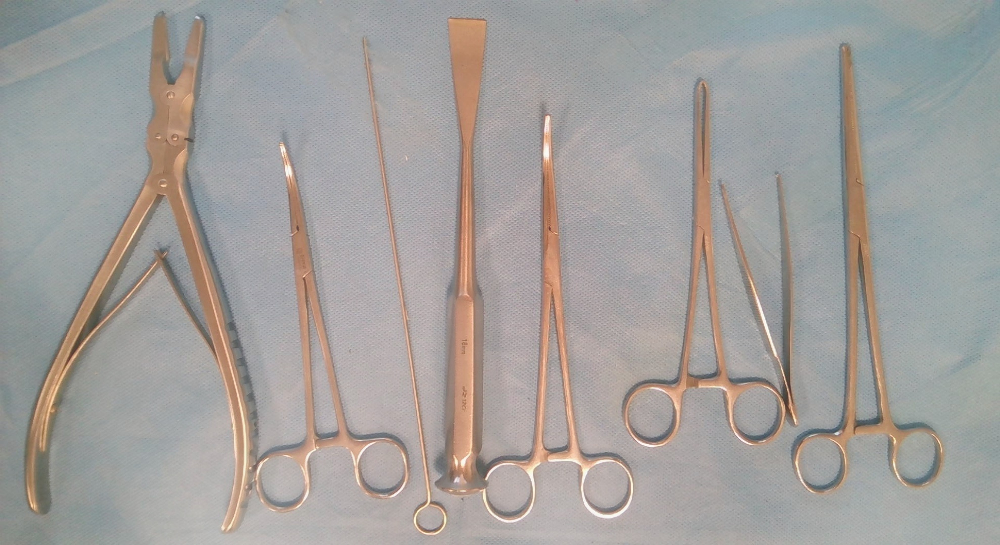 | 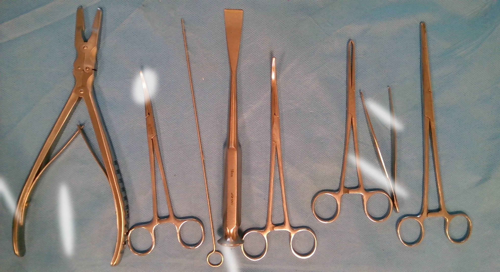 | 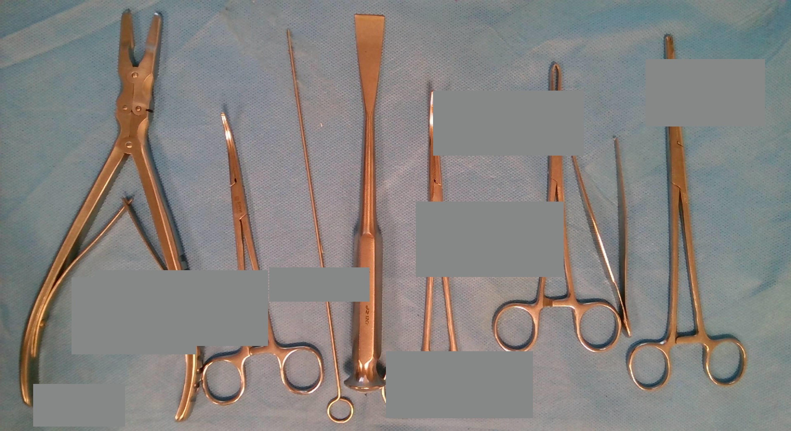 | 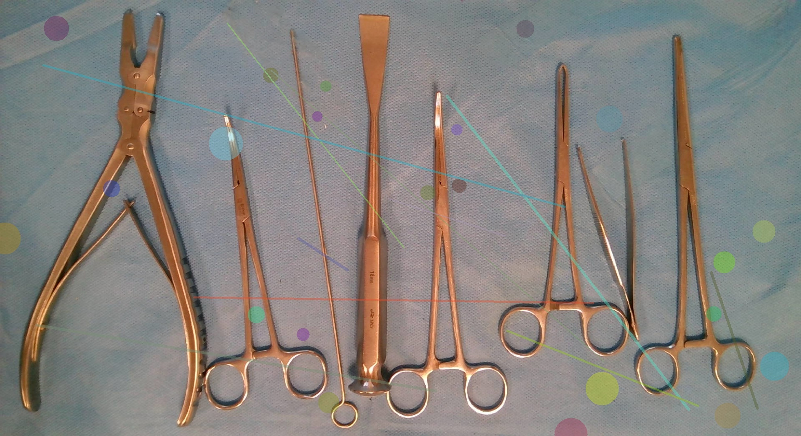 |

*Fig. 6. Representative deterministic stress-test images on OSI26.*

### Tables

<details>
<summary>Show the five manuscript tables</summary>

**Table 1 — Integration positions and learned gating weights**

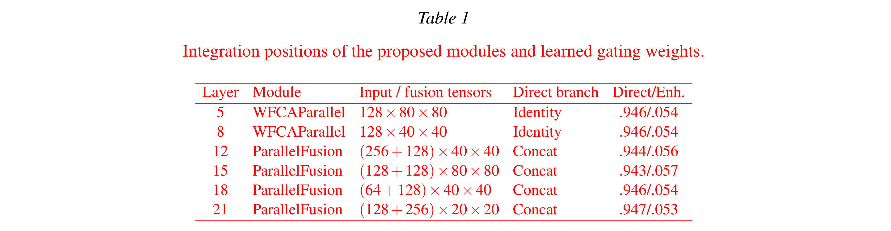

**Table 2 — Batch-1 latency on RTX 3090 at 640×640**

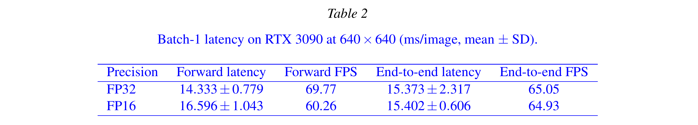

**Table 3 — Five-run performance comparison on OSI26**

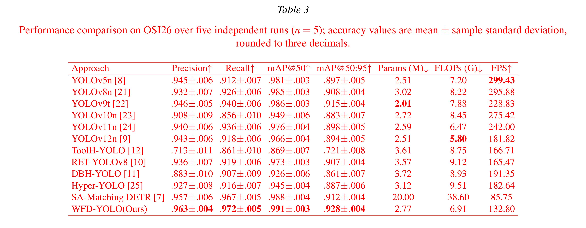

**Table 4 — Class-wise OSI26 results**

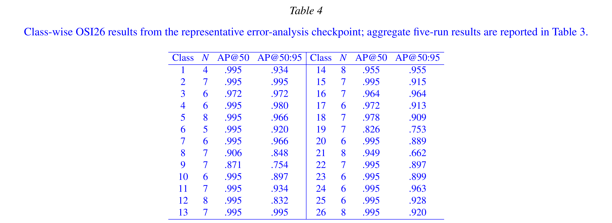

**Table 5 — Deterministic robustness evaluation**

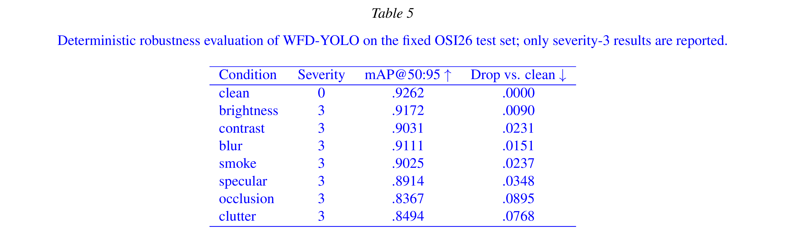

</details>

## Repository layout

```text
ultralytics/                         YOLOv12 source and WFD-YOLO modules
  nn/modules/wfd.py                  WFCA, SFPA, DGFA, and protected parallel gates
  cfg/models/v12/wfd-yolov12n.yaml   full WFD-YOLO model
  cfg/models/v12/*-only.yaml         WFCA-only and SFPA+DGFA ablations
  cfg/datasets/OSI26.yaml             portable dataset configuration
tools/                               dataset conversion and structural checks
train_wfd_yolo.py                    single training entry point
run_wfd_200e.py                      paper protocol: 200 epochs, 640 px, batch 16
reviewer_experiments.py              comparison, timing, per-class and error analysis
reviewer_additional_experiments.py  deterministic robustness and sensitivity analysis
run_reviewer_ablation.py              baseline/WFCA/fusion/full ablation runner
train_sa_matching_detr.py            Transformer comparison runner
```

The comparison and reviewer-analysis scripts are included so the results in Tables 2--5 can be reproduced from the same OSI26 split and evaluation code. Generated runs, logs, corruption datasets, caches, and checkpoints are intentionally excluded from version control; the official `yolov12n.pt` initialization checkpoint is included for convenience.

## Dataset setup

The OSI26 images and annotations are not redistributed. Place the converted dataset at:

```text
data/OSI26_Dataset/
  images/{train,val,test}/
  labels/{train,val,test}/
```

Or pass an alternative dataset YAML with `--data`. To convert Pascal VOC XML annotations without deleting the source XML files:

```powershell
python tools/convert_voc_to_yolo.py C:/path/to/OSI26_Dataset
python tools/verify_wfd.py
```

## Installation

```powershell
python -m venv .venv
.\.venv\Scripts\activate
pip install -r requirements.txt
pip install -e .
```

The requirements file is platform neutral. A CUDA-compatible PyTorch build
should be selected for the local GPU when the default PyPI build is not
appropriate; flash-attn is optional and is not required by the WFD-YOLO model.

## Training and evaluation

Smoke test the model construction first:

```powershell
python train_wfd_yolo.py --epochs 1 --batch 2 --imgsz 320 --fraction 0.02 --name smoke_test
```

Run the manuscript protocol:

```powershell
python run_wfd_200e.py
```

Evaluate a checkpoint:

```powershell
python evaluate_osi26.py --weights runs/wfd-yolo/wfd_yolov12n_parallel_pretrained_osi26_200e/weights/best.pt
```

Run the comparison/reviewer analyses after the checkpoint is available:

```powershell
python reviewer_experiments.py --weights runs/wfd-yolo/wfd_yolov12n_parallel_pretrained_osi26_200e/weights/best.pt
python reviewer_additional_experiments.py --weights runs/wfd-yolo/wfd_yolov12n_parallel_pretrained_osi26_200e/weights/best.pt
python run_reviewer_ablation.py
```

The public repository is intended to document the implementation and evaluation protocol. OSI26 data, generated checkpoints, and machine-specific output directories must be supplied locally by the user.

## Reproducibility record

The manuscript protocol uses 640×640 inputs, batch size 16, 200 epochs, fixed 380/41/31 train/validation/test partitions, validation-only checkpoint selection, and five independent seeds for the comparative table. The reported model uses 2.77 M parameters and 6.91 G FLOPs under the stated measurement setup.
